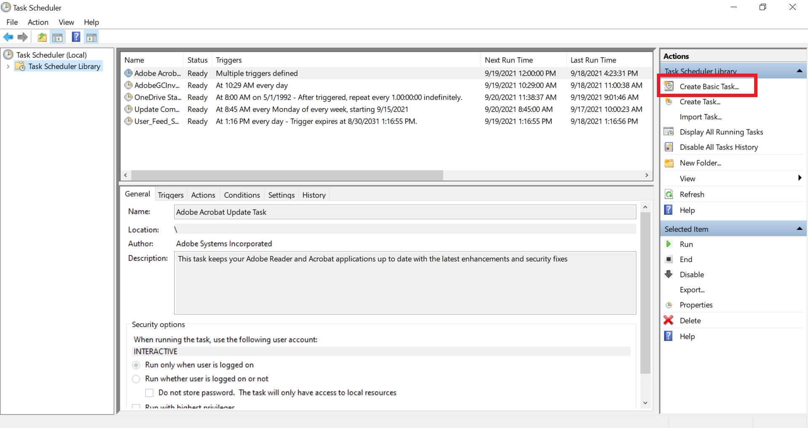
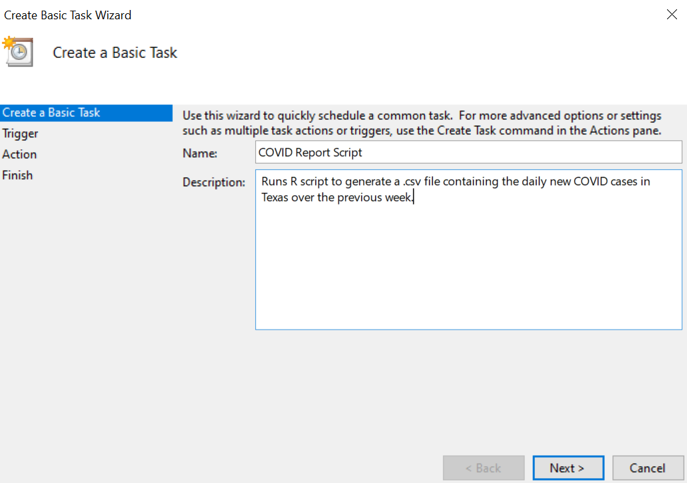
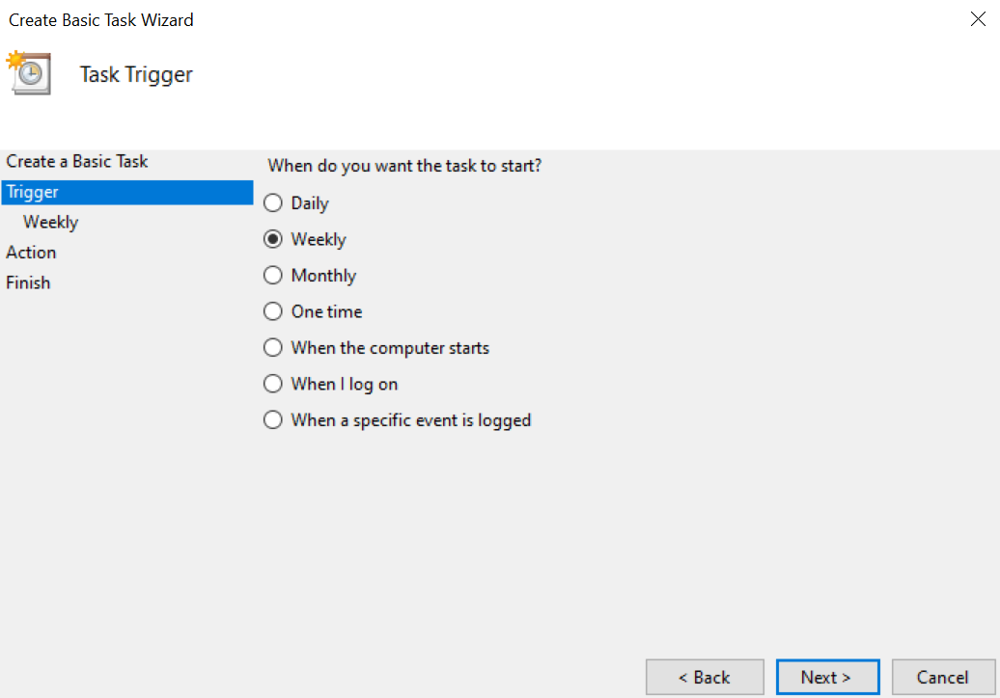
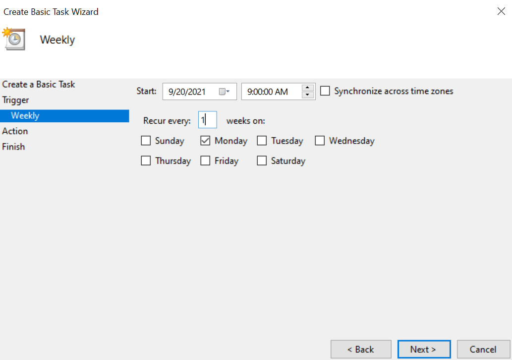
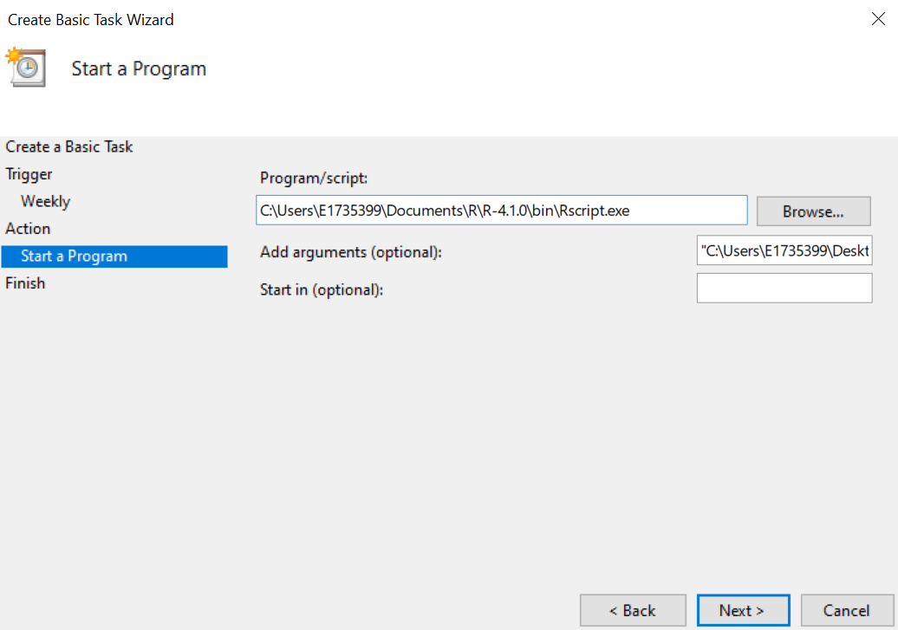
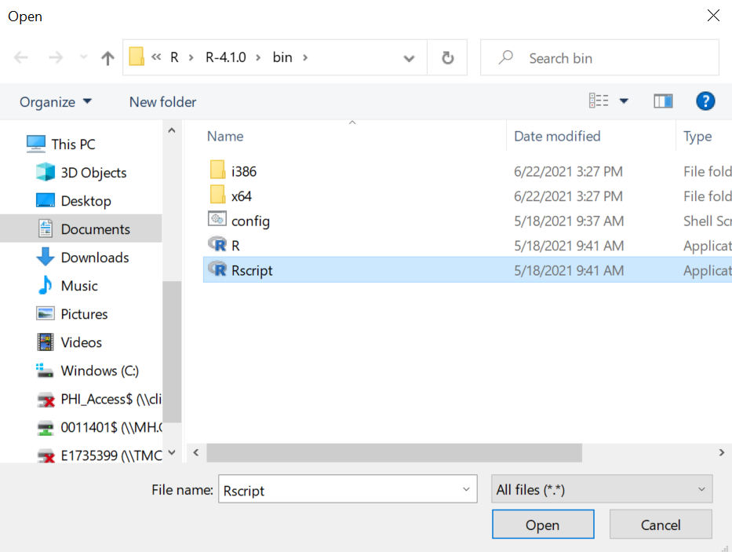
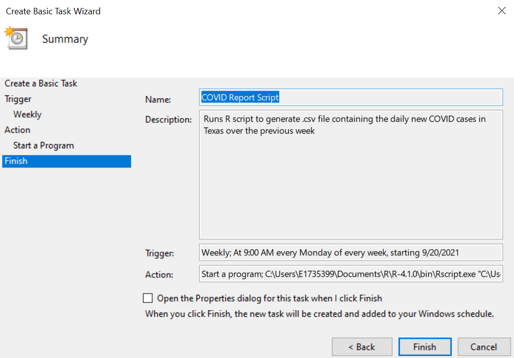
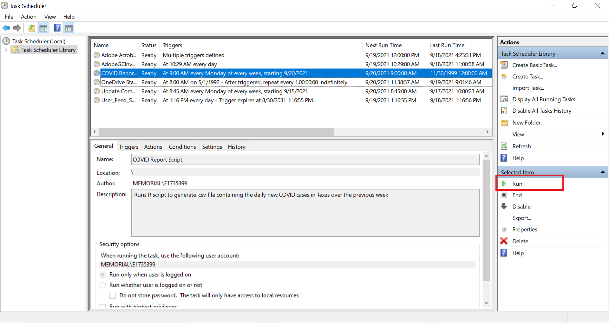

Automated Email Reports with R, VBA, and the Task Scheduler
================
Mark Rieke
9/19/2021

Using R for business often involves generating recurring reports that
are emailed to stakeholders. While R scripts take the legwork out of
creating the report, there is still quite a bit of labor involved in
rerunning the script and sending out an email with the report attached.
Third party automation services, like [GitHub
Actions](https://github.com/features/actions), can run the R script
regularly, but companies working with sensitive data may require that
everything stays within the existing infrastructure. Many companies use
Outlook as the email platform and although there is an R package for
sending email, [mailR](https://rpremraj.github.io/mailR/), companies
with software security that errs on the side of caution may not work
well with the package. Analysts, therefore, may find themselves in a
unique scenario requiring localized automation of report building and
emailing via Outlook. The solution? Convincing R, VBA, and Window’s Task
Scheduler to work together to meet your automation needs.

In this article, we’ll look at three basic workflows:

-   Generating a report with R
-   Automatically running a script with the Task Scheduler
-   Automatically sending emails via Outlook with VBA

> This article is heavily informed by [Sean Carney’s article on running
> scripts with the Task
> Scheduler](http://www.seancarney.ca/2020/10/11/scheduling-r-scripts-to-run-automatically-in-windows/)
> and [Shirly Zhang’s article on scheduling emails with
> VBA](https://www.datanumen.com/blogs/auto-send-recurring-email-periodically-outlook-vba/).
> This article merges the two concepts and points out additional
> stumbling blocks, but the original articles are well worth viewing.

## Generating a Report with R

Suppose we want to create a .csv file containing a weekly summary of the
daily new COVID cases in Texas. Our script to generate the report may
look something like this:

``` r
library(dplyr)
library(readr)

# set working directory
setwd("C:/path/to/your/directory")

# read in data
nyt_covid <- read_csv("https://raw.githubusercontent.com/nytimes/covid-19-data/master/us-states.csv")

# get texas' daily new cases in the past week
nyt_covid <- 
  nyt_covid %>%
  group_by(state) %>%
  mutate(new_cases = cases - lag(cases),
         new_deaths = deaths - lag(deaths)) %>%
  filter(date >= Sys.Date() - 7,
         state == "Texas")

# save file
nyt_covid %>%
  write_csv("new_cases_tx.csv")
```

It may seem out out of place, but we need to explicitly set the working
directory of the project *within* the script itself. When the Task
Scheduler executes this script, it does so out of a different directory,
so we need to tell R to change the working directory.

## Running Scripts with the Task Scheduler

Windows’ Task Scheduler is an OS level job scheduler that, as the name
suggests, completes tasks based on “triggers” (in this case, we’re using
the system time as a trigger, but other options are available in the
scheduler). To setup a task that runs the COVID script weekly, follow
these instructions:

#### 1. Open the Task Scheduler and select “Create Basic Task”



#### 2. Give your task a useful name and description



#### 3. Select when the recurring task will run





#### 4. Select “Start a program” as the task action


Later on, we’ll use VBA to automatically send emails to avoid any
deprecation issues with the “Send an e-mail” function in the scheduler.

#### 5. Enter the path to `Rscript.exe` into the program field and the path to your script into the argument field



This is where we tell the Task Scheduler to use R! `Rscript.exe` should
be saved under the `R\R-version-you-have-installed\bin` folder. You can
likely find the `R` folder under `C:\Program Files\` or
`C:\Program Files (x86)\`. This informs your computer to use R to run
the script at the path in the argument.



There are a few caveats worth noting:

-   Unlike R, Windows uses back slashes in the folder path; be sure the
    path contains `\` and not `/`!
-   The Task Scheduler can’t handle spaces in folder path names - if any
    of the folders in the path to `Rscript.exe` or your report script
    contain spaces, be sure to encapsulate with quotations! For example,
    `C:\Folder Path with Spaces\COVID_script.R` will fail, but
    `"C:\Folder Path with Spaces\COVID_script.R"` will run.

#### 6. Click Finish



Viola! Your R script is now scheduled to run on a recurring basis. You
test that the task is setup correctly by highlighting the task and
selecting “Run” in the lower right corner of the scheduler window.



## Automating Emails with VBA

Outlook, unfortunately, doesn’t have a built-in method for sending
recurring emails. With a bit of VBA, however, we can get around this
issue. VBA (or, Visual Basic for Applications) is Microsoft’s
event-driven programming language that runs within each application. To
automatically send emails on a recurring basis, we’ll setup a recurring
appointment that will serve as the event causing emails to send. Then,
we’ll write a macro (VBA’s equivalent to an R script) that will send an
email every time a reminder for this appointment appears.

#### 1. Create a new recurring appointment

#### 2. Assign the appointment to a new category for sending automated emails

#### 3. Add the Developer tab to Outlook’s ribbon

#### 4. Enable Macros

#### 5. Add the following sub to `ThisOutlookSession`
